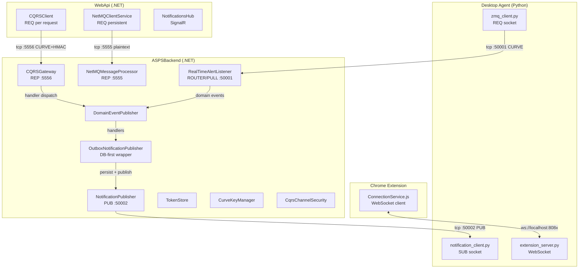
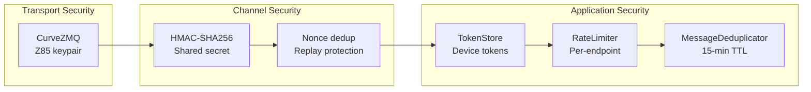
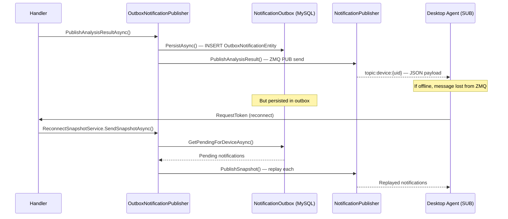
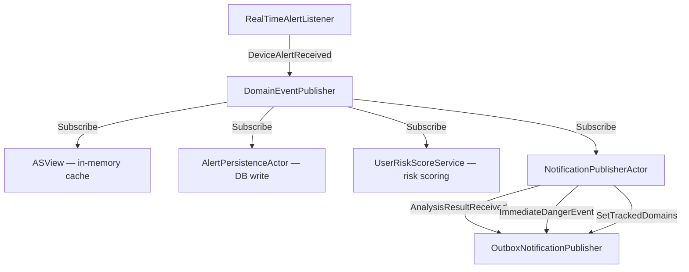
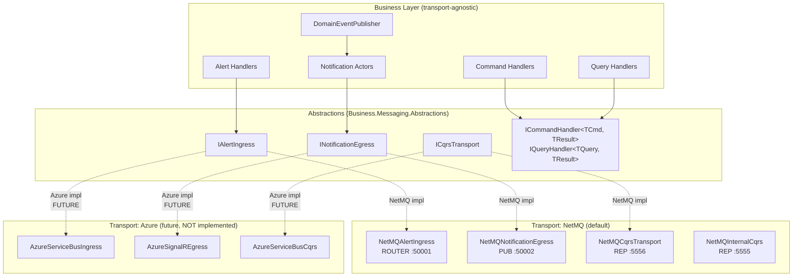
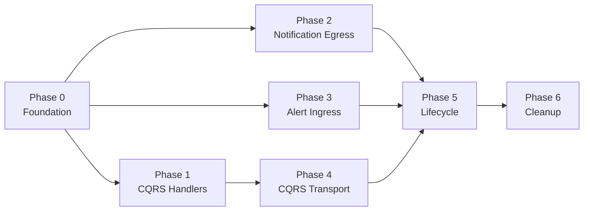

# ASPS Messaging Refactoring — Implementation Specification

> **Status:** Draft — awaiting CEO/owner approval before implementation  
> **Date:** 2026-08-03  
> **Author:** CEO Agent (research-only phase)  
> **Constraint:** No production code changes until approved

---

## Table of Contents

1. [Executive Summary](#1-executive-summary)
2. [Goals](#2-goals)
3. [Non-Goals](#3-non-goals)
4. [Current Architecture (As-Is)](#4-current-architecture-as-is)
5. [Problems and Risks](#5-problems-and-risks)
6. [Design Principles](#6-design-principles)
7. [Target Architecture (To-Be)](#7-target-architecture-to-be)
8. [File-by-File Change Plan](#8-file-by-file-change-plan)
9. [New Interfaces and Classes](#9-new-interfaces-and-classes)
10. [DI and Service Lifetimes](#10-di-and-service-lifetimes)
11. [Migration Plan](#11-migration-plan)
12. [Jira Work Breakdown](#12-jira-work-breakdown)
13. [Test Plan](#13-test-plan)
14. [Definition of Done](#14-definition-of-done)
15. [Open Questions](#15-open-questions)
16. [Appendix](#16-appendix)

---

# 1. Executive Summary

The ASPS messaging subsystem is the nervous system of the product — it carries real-time alerts from protected devices to the backend for analysis and delivers protective notifications back. Today, every component is hardwired to NetMQ (ZeroMQ for .NET), meaning:

- **Business logic is entangled with transport.** Handlers know about sockets, frames, and CURVE keys.
- **Azure deployment is blocked.** NetMQ requires raw TCP ports; Azure App Service, Container Apps, and most PaaS offerings do not expose arbitrary TCP listeners.
- **Testing is fragile.** Many tests require real sockets, timeouts, and port binding — slow and flaky in CI.
- **The CQRS gateway uses manual `switch` dispatch** on string-typed command/query names — hard to extend, no compile-time safety.

This specification defines a refactoring that:

1. **Extracts transport abstractions** (`IMessageTransport`, `IAlertIngress`, `INotificationEgress`, `ICqrsTransport`) so business logic depends only on interfaces.
2. **Preserves NetMQ as the default transport** — the first implementation of every interface remains NetMQ-backed. No functionality changes.
3. **Enables future Azure transports** (Azure Service Bus, Azure SignalR) as drop-in replacements wired through DI — but does NOT implement them yet.
4. **Replaces manual switch dispatch** in the CQRS gateway with auto-discovered, type-safe handler registration.
5. **Converts messaging services to `IHostedService`** for proper lifecycle management.

The refactoring is designed for **zero behavioral change** — same ports, same wire protocol, same message schemas, same CURVE encryption. The desktop agent and Chrome extension require no changes.

---

# 2. Goals

| ID | Goal | Measure |
|----|------|---------|
| G-1 | **Decouple business logic from NetMQ transport** | No `using NetMQ` in handler code; handlers depend only on `Business.Messaging.Abstractions` |
| G-2 | **Enable future Azure deployment** | An Azure transport can be wired via DI config change, no handler modifications |
| G-3 | **Type-safe CQRS dispatch** | Commands/queries routed by CLR type, not string switch; compile-time handler registration |
| G-4 | **Proper lifecycle management** | All messaging services implement `IHostedService`; startup/shutdown orchestrated by the host |
| G-5 | **Improve testability** | All transport interfaces mockable; handler tests run without sockets |
| G-6 | **Preserve backward compatibility** | Same wire protocol, ports, message schemas; desktop agent and extension unchanged |
| G-7 | **Preserve security guarantees** | CURVE encryption and HMAC-SHA256 channel security remain intact |

---

# 3. Non-Goals

| ID | Excluded | Rationale |
|----|----------|-----------|
| NG-1 | Implement Azure Service Bus / SignalR transport | Out of scope — interfaces only; Azure transport is a future project |
| NG-2 | Replace Newtonsoft.Json with System.Text.Json | Orthogonal concern; can be done independently later |
| NG-3 | Change message schemas or wire protocol | Would break desktop agent and extension |
| NG-4 | Remove NetMQ dependency | NetMQ remains the production transport; only the coupling changes |
| NG-5 | Redesign the domain event system | DomainEventPublisher is internal to business logic, not transport |
| NG-6 | Change external ports (50001, 50002, 5555, 5556) | Would break deployed agents |
| NG-7 | Implement message broker (RabbitMQ, Kafka) | Azure Service Bus is the planned future path, not self-hosted brokers |
| NG-8 | Fix the `*:` bind security debt on ports 5555/5556 | Tracked separately; this refactoring preserves existing bind behavior |

---

# 4. Current Architecture (As-Is)

## 4.1 Component Map



## 4.2 Socket Inventory

| Port | Component | Socket Type | Direction | CURVE | HMAC | Purpose |
|------|-----------|-------------|-----------|-------|------|---------|
| 50001 | RealTimeAlertListener | ROUTER (or PULL) | Device → Backend | Yes (configurable) | No | Alert ingress, token management |
| 50002 | NotificationPublisher | PUB | Backend → Device | Yes | No | Analysis results, danger notifications |
| 5555 | NetMQMessageProcessor | REP | WebApi → Backend | No (localhost) | No | Legacy internal CQRS |
| 5556 | CQRSGateway | REP | WebApi → Backend | Yes | Yes (HMAC-SHA256) | Primary CQRS gateway |

## 4.3 Key Files

| File | Lines | Responsibility |
|------|-------|----------------|
| `Business/Messaging/RealTimeAlertListener.cs` | ~886 | Alert ingress, token auth, rate limiting, alert dispatch |
| `Business/Messaging/NotificationPublisher.cs` | ~455 | PUB socket, topic routing, notification formatting |
| `Business/Messaging/OutboxNotificationPublisher.cs` | ~237 | Outbox durability wrapper (ASPS-620) |
| `Business/Messaging/CQRSGateway.cs` | ~150 | CQRS listen loop, authenticated envelope unpacking |
| `Business/Messaging/CQRSGateway.Commands.cs` | 378 | Manual switch dispatch for 21 command types |
| `Business/Messaging/CQRSGateway.Queries.cs` | 878 | Manual switch dispatch for 50 query types |
| `Business/Messaging/NetMQMessageProcessor.cs` | ~170 | Internal CQRS (port 5555), handler delegation |
| `Business/Messaging/CqrsChannelSecurity.cs` | ~180 | HMAC-SHA256 sign/verify, nonce dedup, replay protection |
| `Business/Messaging/CqrsJsonSerialization.cs` | ~60 | Newtonsoft.Json settings, TypeNameHandling.None |
| `Business/Messaging/MessageDeduplicator.cs` | ~70 | 15-min TTL, 100K capacity, thread-safe dedup |
| `Business/Messaging/MessagingCompatibility.cs` | ~50 | Protocol version negotiation, legacy V0 |
| `Business/Messaging/ReconnectSnapshotService.cs` | ~110 | Pending notification replay on device reconnect |
| `Business/Services/CurveKeyManager.cs` | ~305 | Key generation, file storage, Z85 encoding |
| `WebApi/Services/CQRSClient.cs` | ~216 | REQ socket per request, 10s timeout, CURVE+HMAC |
| `WebApi/Services/ICQRSClient.cs` | ~10 | SendQueryAsync, SendCommandAsync |
| `WebApi/Services/NetMQClientService.cs` | ~84 | Legacy REQ client on port 5555 |
| `ASPSBackend/Program.cs` | ~293 | Manual startup, DI registration |
| `Common/Messaging/CQRS.cs` | ~45 | BaseMessage, Command, Query, result types |
| `Common/Generated/Messaging/V1/MessageEnvelope.cs` | ~100 | MessageEnvelopeV1 schema |

## 4.4 Threading Model

All messaging services use `Task.Run()` with blocking receive loops — **not** `IHostedService`:

```
Program.cs startup sequence:
  1. ASView.Start()
  2. NetMQMessageProcessor.Start()     → Task.Run(() => ProcessMessages())
  3. RealTimeAlertListener.Start()     → Task.Run(() => ListenForAlerts())
  4. CQRSGateway.Start()              → Task.Run(() => ListenLoop())
```

- Each service owns a `_isRunning` / `_running` boolean flag.
- `Stop()` sets the flag to `false`; the blocking `Receive*()` call eventually returns or throws.
- `Linger = TimeSpan.Zero` on all sockets — immediate close, no drain.
- No `CancellationToken` propagation.
- No `NetMQPoller` used anywhere.

**Exceptions:** `SimulationRunner` and `OutboxPruningService` do use `BackgroundService` (IHostedService).

## 4.5 CQRS Dispatch (Current)

The CQRSGateway routes by string matching:

```csharp
// CQRSGateway.Commands.cs (simplified)
switch (command.CommandType)
{
    case "UpdateDevice":
        var handler = scope.ServiceProvider.GetRequiredService<IUpdateDeviceHandler>();
        return await handler.Handle(command);
    case "CreateUser":
        // ...
    // ~19 more cases
    default:
        return CreateErrorResponse($"Unknown command: {command.CommandType}");
}
```

**Problems with current dispatch:**
- No compile-time verification that all 71 command/query types have handlers
- Adding a command/query requires editing the switch in `CQRSGateway.Commands.cs` or `.Queries.cs`
- Handler resolution is manual (`GetRequiredService<ISpecificHandler>`)
- 67 of 71 cases follow identical 6-line boilerplate (deserialize → resolve → handle → serialize)
- Test coverage requires testing through the full gateway

## 4.6 Serialization

- **Library:** Newtonsoft.Json 13.0.4 (all layers)
- **Settings:** `TypeNameHandling.None` (ASPS-66 security fix), `ReferenceLoopHandling.Ignore`
- **Two paths:**
  - Direct: `JsonConvert.DeserializeObject<T>(json, settings)`
  - Validated: `MessageEnvelopeValidator.DeserializeAndValidate()` for V1 envelopes
- **V1 envelope coverage (ASPS-732):** As of 2026-08-25, all alert types use the V1 envelope: `url_scan.request`, `track_url.request`, `tab_closed.request`, `tab_changed.request`, `remote_access.request`. Token/registration messages remain flat JSON. Azure production runs with `Messaging:AcceptLegacyV0=false`.
- **No MessagePack, no Protobuf** — pure JSON throughout

## 4.7 Security Architecture



- **CURVE:** Mandatory on ports 50001 and 50002 (configurable). Not used on 5555 (internal). Required on 5556.
- **HMAC-SHA256:** CqrsChannelSecurity wraps CQRS messages in signed envelopes with nonce + timestamp.
- **Replay protection:** FixedTimeEquals for timing-attack-safe comparison.
- **Token auth:** 3-hour device tokens, validated on every alert.
- **Rate limiting:** 5 req/min for token requests, 3 req/min for registration.

## 4.8 Desktop Agent Protocol

The Python desktop agent (`apps/desktop/win/src/`) communicates via:

| Channel | Library | Pattern | Port | CURVE |
|---------|---------|---------|------|-------|
| Alerts → Backend | pyzmq REQ | Request-Response | 50001 | Mandatory (no plaintext fallback) |
| Backend → Notifications | pyzmq SUB | Pub-Sub | 50002 | Mandatory |
| Extension ↔ Agent | websockets | WebSocket | 8080–8484 | N/A (localhost) |

**Key constraints for refactoring:**
- Desktop agent generates ephemeral CURVE keypairs per connection
- 5-second send/receive timeouts (`zmq.RCVTIMEO`, `zmq.SNDTIMEO`)
- `_send_lock` serializes all socket operations (thread safety)
- Auth flow: `RequestToken` → token stored in OS keyring → `RefreshToken` before expiry
- **No changes to the desktop agent are permitted in this refactoring**

## 4.9 Notification Delivery (ASPS-620 Outbox Pattern)



- **OutboxPruningService:** Hourly, removes acknowledged entries older than 7 days.
- **ReconnectSnapshotService:** On device reconnect, replays all pending notifications.

## 4.10 Domain Event Flow



**Event handlers registered as singletons in Program.cs (lines 215–226):**
- `ASView` — in-memory device/user cache
- `AlertPersistenceActor` — persists alert to `DeviceAlertEntity`
- `AnalysisPersistenceActor` — persists analysis result
- `ImmediateDangerPersistanceActor` — persists danger flag
- `NotificationPublisherActor` — publishes via outbox
- `UserRiskScoreService` — per-user risk score (SCRUM-904)

---

# 5. Problems and Risks

## 5.1 Architectural Problems

| ID | Problem | Impact | Severity |
|----|---------|--------|----------|
| P-1 | **Business logic coupled to NetMQ** — handlers import `NetMQ`, know about frames, sockets | Cannot deploy to Azure PaaS; cannot swap transport | Blocker for Azure |
| P-2 | **Manual switch dispatch in CQRSGateway** — string-based routing, 71 cases across 2 files (1,256 lines of boilerplate) | No compile-time safety, error-prone extension, violates OCP | Major |
| P-3 | **No IHostedService** — manual `Task.Run()` + boolean flags for lifecycle | No graceful shutdown orchestration, no CancellationToken, no health checks | Major |
| P-4 | **Dual CQRS channels** — port 5555 (no security) + port 5556 (CURVE+HMAC) serve overlapping functions | Confusion, maintenance burden, security inconsistency | Major |
| P-5 | **Per-request socket creation** in CQRSClient — `new RequestSocket()` per query/command | Socket handshake overhead, no connection pooling | Minor (functional but wasteful) |
| P-6 | **Blocking receives without CancellationToken** — `ReceiveFrameString()` blocks indefinitely | Cannot gracefully shut down; relies on Linger=0 socket close | Major |
| P-7 | **Lock contention** — `_sendLock` on NotificationPublisher, `_lock` on NetMQClientService | Serializes all sends under high concurrency | Minor (NetMQ sockets not thread-safe) |

## 5.2 Security Debt (Existing — Not Introduced by This Refactoring)

| ID | Debt | Current Mitigation |
|----|------|--------------------|
| SD-1 | Port 5555 bound to `*:` with no encryption | Intended for localhost only; not exposed externally |
| SD-2 | Port 5556 bound to `*:` (should be `127.0.0.1:`) | CURVE + HMAC compensate, but bind address is too broad |
| SD-3 | MySQL 3306 exposed in docker-compose | Dev-only; production deployment TBD |
| SD-4 | `ws://` between extension and agent (not `wss://`) | Localhost only; system-boundary trust |

**Constraint:** This refactoring must NOT add new security debt and must NOT remove existing mitigations.

## 5.3 Technical Risks of This Refactoring

| ID | Risk | Likelihood | Impact | Mitigation |
|----|------|-----------|--------|------------|
| R-1 | Abstraction adds latency to hot path | Low | Medium | Benchmark before/after; interface call overhead is nanoseconds |
| R-2 | Existing tests break during migration | Medium | High | Phase migration; preserve all test files; adapter pattern |
| R-3 | Subtle behavioral differences after refactoring | Medium | High | Golden-path integration tests before refactoring; run as regression suite |
| R-4 | Desktop agent compatibility break | Low | Critical | Zero wire-protocol changes; same ports, same JSON, same CURVE |
| R-5 | CURVE/HMAC security regression | Low | Critical | Security review gate on every phase; existing security tests must pass |
| R-6 | Thread-safety regression in notification publishing | Medium | High | Existing `_sendLock` pattern preserved in NetMQ transport implementation |

---

# 6. Design Principles

| Principle | Application |
|-----------|-------------|
| **Dependency Inversion** | Business logic depends on abstractions (`IAlertIngress`, `INotificationEgress`, `ICqrsTransport`); transport implementations depend on those same abstractions |
| **Interface Segregation** | Separate interfaces for alert ingress, notification egress, and CQRS — not one `IMessaging` god-interface |
| **Open/Closed** | Adding a new transport (Azure Service Bus) = adding new classes, not modifying existing handlers |
| **Strangler Fig** | Migrate one component at a time behind its interface; old and new coexist during migration |
| **Preserve Wire Compatibility** | Same JSON schemas, same ports, same CURVE — the transport abstraction is internal to the backend |
| **Test-First Migration** | Write interface-level tests before extracting; verify before and after |

---

# 7. Target Architecture (To-Be)

## 7.1 High-Level Architecture



## 7.2 Transport Abstraction Interfaces

### Alert Ingress

```csharp
namespace Business.Messaging.Abstractions;

public interface IAlertIngress : IHostedService, IDisposable
{
    // No public methods needed — it listens and dispatches via DomainEventPublisher.
    // Configuration (port, CURVE) is constructor-injected.
}
```

The alert ingress is a listener — it receives messages, validates tokens, and raises domain events. Business logic never calls it directly; it is a hosted service that runs in the background.

### Notification Egress

```csharp
namespace Business.Messaging.Abstractions;

public interface INotificationEgress
{
    Task PublishAnalysisResultAsync(AnalysisResultNotification notification);
    Task PublishImmediateDangerAsync(ImmediateDangerNotification notification);
    Task PublishImmediateDangerEndedAsync(ImmediateDangerEndedNotification notification);
    Task PublishSetTrackedDomainsAsync(SetTrackedDomainsNotification notification);
    Task PublishSetBrowserTabsPolicyAsync(SetBrowserTabsPolicyNotification notification);
    Task PublishSnapshotAsync(string deviceUid, string rawJson);
}
```

### CQRS Transport (Server-Side — Backend)

```csharp
namespace Business.Messaging.Abstractions;

public interface ICqrsTransport : IHostedService, IDisposable
{
    // Hosted service — listens for incoming command/query messages,
    // dispatches to registered ICommandHandler / IQueryHandler,
    // and returns the result.
}
```

### CQRS Transport (Client-Side — WebApi)

```csharp
namespace Business.Messaging.Abstractions;

public interface ICqrsClient : IDisposable
{
    Task<TResult> SendQueryAsync<TResult>(Query query, CancellationToken ct = default);
    Task<TResult> SendCommandAsync<TResult>(Command command, CancellationToken ct = default);
}
```

This replaces the existing `ICQRSClient` with the same signature but in the abstractions namespace.

### Type-Safe Handler Interfaces

```csharp
namespace Business.Messaging.Abstractions;

public interface ICommandHandler<TCommand, TResult>
    where TCommand : Command
{
    Task<TResult> HandleAsync(TCommand command, CancellationToken ct = default);
}

public interface IQueryHandler<TQuery, TResult>
    where TQuery : Query
{
    Task<TResult> HandleAsync(TQuery query, CancellationToken ct = default);
}
```

## 7.3 Component Responsibilities (Target)

| Component | Knows About | Does NOT Know About |
|-----------|-------------|---------------------|
| Alert handlers | Domain events, business logic, `INotificationEgress` | Sockets, frames, CURVE, ports |
| NotificationPublisherActor | `INotificationEgress` (interface) | NetMQ, PUB socket, topics |
| Command/Query handlers | Domain logic, repositories | Transport, sockets, serialization |
| NetMQAlertIngress | ROUTER socket, CURVE, frame parsing | Business logic decisions |
| NetMQNotificationEgress | PUB socket, topic routing | What to publish (receives DTOs) |
| NetMQCqrsTransport | REP socket, HMAC, handler dispatch | Individual handler logic |
| CqrsHandlerRegistry | Handler type → handler instance mapping | Transport, sockets |

## 7.4 Type-Safe CQRS Dispatch (Target)

Replace the manual switch with a registry pattern:

```csharp
namespace Business.Messaging;

public class CqrsHandlerRegistry
{
    private readonly Dictionary<string, Func<IServiceProvider, object>> _commandHandlers = new();
    private readonly Dictionary<string, Func<IServiceProvider, object>> _queryHandlers = new();

    public void RegisterCommand<TCommand, TResult>(string commandType)
        where TCommand : Command
    {
        _commandHandlers[commandType] = sp =>
            sp.GetRequiredService<ICommandHandler<TCommand, TResult>>();
    }

    public void RegisterQuery<TQuery, TResult>(string queryType)
        where TQuery : Query
    {
        _queryHandlers[queryType] = sp =>
            sp.GetRequiredService<IQueryHandler<TQuery, TResult>>();
    }

    public async Task<CommandResult> DispatchCommandAsync(
        Command command, IServiceProvider scope)
    {
        if (!_commandHandlers.TryGetValue(command.CommandType, out var factory))
            return new CommandResult { Success = false, Message = $"Unknown command: {command.CommandType}" };

        var handler = factory(scope);
        // Invoke via reflection or known dispatch interface
        return await InvokeHandlerAsync(handler, command);
    }

    // Similar for queries
}
```

**Registration at startup (replaces the switch):**

```csharp
registry.RegisterCommand<CreateUserAdminCommand, CommandResult>("CreateUserAdminCommand");
registry.RegisterCommand<CreateUserCommand, CommandResult>("CreateUserCommand");
// ...all 21 commands
registry.RegisterQuery<GetDashboardStatsQuery, QueryResult>("GetDashboardStatsQuery");
registry.RegisterQuery<GetAllDevicesPagedQuery, QueryResult>("GetAllDevicesPagedQuery");
// ...all 50 queries
```

---

# 8. File-by-File Change Plan

## 8.1 New Files

| File | Purpose |
|------|---------|
| `Business/Messaging/Abstractions/IAlertIngress.cs` | Alert listener abstraction |
| `Business/Messaging/Abstractions/INotificationEgress.cs` | Notification publisher abstraction |
| `Business/Messaging/Abstractions/ICqrsTransport.cs` | CQRS server-side transport abstraction |
| `Business/Messaging/Abstractions/ICqrsClient.cs` | CQRS client-side abstraction (replaces `ICQRSClient`) |
| `Business/Messaging/Abstractions/ICommandHandler.cs` | Generic command handler interface |
| `Business/Messaging/Abstractions/IQueryHandler.cs` | Generic query handler interface |
| `Business/Messaging/CqrsHandlerRegistry.cs` | Type-safe command/query dispatch registry |
| `Business/Messaging/Transport/NetMQ/NetMQAlertIngress.cs` | NetMQ implementation of IAlertIngress |
| `Business/Messaging/Transport/NetMQ/NetMQNotificationEgress.cs` | NetMQ implementation of INotificationEgress |
| `Business/Messaging/Transport/NetMQ/NetMQCqrsTransport.cs` | NetMQ implementation of ICqrsTransport |
| `Business/Messaging/Transport/NetMQ/NetMQCqrsClient.cs` | NetMQ implementation of ICqrsClient |
| `Business/Messaging/MessagingServiceRegistration.cs` | DI registration extension method |

## 8.2 Modified Files

| File | Changes |
|------|---------|
| `Business/Messaging/RealTimeAlertListener.cs` | Extract transport logic to `NetMQAlertIngress`; business logic (token validation, alert processing, domain event dispatch) stays but receives messages from `IAlertIngress` callbacks |
| `Business/Messaging/NotificationPublisher.cs` | Rename to `NetMQNotificationEgress`; implement `INotificationEgress`; keep PUB socket logic |
| `Business/Messaging/OutboxNotificationPublisher.cs` | Change dependency from `NotificationPublisher` to `INotificationEgress` |
| `Business/Messaging/CQRSGateway.cs` | Extract socket handling to `NetMQCqrsTransport`; replace manual dispatch with `CqrsHandlerRegistry` |
| `Business/Messaging/CQRSGateway.Commands.cs` | Convert each `case` to an `ICommandHandler<T, R>` implementation; register in `CqrsHandlerRegistry` |
| `Business/Messaging/CQRSGateway.Queries.cs` | Convert each `case` to an `IQueryHandler<T, R>` implementation; register in `CqrsHandlerRegistry` |
| `Business/Messaging/NetMQMessageProcessor.cs` | Implement `IHostedService`; extract handler dispatch to registry |
| `Business/Messaging/ReconnectSnapshotService.cs` | Change dependency from `NotificationPublisher` to `INotificationEgress` |
| `Business/Messaging/NotificationPublisherActor.cs` (in Services/) | Change dependency from `OutboxNotificationPublisher` to `INotificationEgress` (via outbox wrapper) |
| `WebApi/Services/CQRSClient.cs` | Rename to `NetMQCqrsClient`; implement `ICqrsClient` |
| `WebApi/Services/ICQRSClient.cs` | Replace with `ICqrsClient` in abstractions (or keep as alias during migration) |
| `ASPSBackend/Program.cs` | Replace manual `Start()` calls with `IHostedService` registration; use `MessagingServiceRegistration` |
| `WebApi/Program.cs` (or `BusinessServiceRegistration.cs`) | Register `ICqrsClient` → `NetMQCqrsClient` |

## 8.3 Files Removed (After Migration Complete)

| File | Replacement |
|------|-------------|
| `Business/Messaging/CQRSGateway.Commands.cs` | Individual `ICommandHandler<T, R>` classes |
| `Business/Messaging/CQRSGateway.Queries.cs` | Individual `IQueryHandler<T, R>` classes |
| `WebApi/Services/NetMQClientService.cs` | Consolidated into `NetMQCqrsClient` or deprecated (port 5555 consolidation — see Open Questions) |

## 8.4 Files NOT Changed

| File | Reason |
|------|--------|
| `Common/Messaging/CQRS.cs` | Base message types unchanged |
| `Common/Generated/Messaging/V1/MessageEnvelope.cs` | Wire schema unchanged |
| `Business/Messaging/CqrsChannelSecurity.cs` | Security layer independent of transport; used by NetMQ transport impl |
| `Business/Messaging/CqrsJsonSerialization.cs` | Serialization independent of transport |
| `Business/Messaging/MessageDeduplicator.cs` | Application-level dedup, not transport |
| `Business/Messaging/MessagingCompatibility.cs` | Protocol versioning, used by alert ingress impl |
| `Business/Services/CurveKeyManager.cs` | Used by NetMQ transport impls only |
| `apps/desktop/win/**` | No changes to desktop agent |
| `apps/extension/chrome/**` | No changes to extension |

---

# 9. New Interfaces and Classes

## 9.1 Abstraction Layer (`Business/Messaging/Abstractions/`)

```
Business/Messaging/Abstractions/
├── IAlertIngress.cs            — Alert listener contract
├── INotificationEgress.cs      — Notification publisher contract
├── ICqrsTransport.cs           — CQRS server-side listener contract
├── ICqrsClient.cs              — CQRS client-side sender contract
├── ICommandHandler.cs          — Generic command handler
├── IQueryHandler.cs            — Generic query handler
└── AlertReceivedContext.cs     — DTO passed from ingress to business logic
```

### AlertReceivedContext

A transport-agnostic DTO that the alert ingress passes to business logic:

```csharp
namespace Business.Messaging.Abstractions;

public record AlertReceivedContext(
    string RawJson,
    string? ClientIdentity,    // ROUTER identity frame (null for non-ROUTER transports)
    DateTimeOffset ReceivedAt
);
```

## 9.2 Transport Layer (`Business/Messaging/Transport/NetMQ/`)

```
Business/Messaging/Transport/NetMQ/
├── NetMQAlertIngress.cs        — IAlertIngress via ROUTER/PULL socket
├── NetMQNotificationEgress.cs  — INotificationEgress via PUB socket
├── NetMQCqrsTransport.cs       — ICqrsTransport via REP socket
└── NetMQCqrsClient.cs          — ICqrsClient via REQ socket (WebApi-side)
```

## 9.3 Handler Registry

```
Business/Messaging/
├── CqrsHandlerRegistry.cs      — Type-safe dispatch map
└── Handlers/
    ├── Commands/                — One file per ICommandHandler<T, R>
    │   ├── UpdateDeviceHandler.cs
    │   ├── CreateUserHandler.cs
    │   └── ... (21 files total)
    └── Queries/                 — One file per IQueryHandler<T, R>
        ├── GetDashboardStatsHandler.cs
        ├── GetAllDevicesPagedHandler.cs
        └── ... (50 files total, or grouped by handler class — see OQ-6)
```

## 9.4 DI Registration

```
Business/Messaging/
└── MessagingServiceRegistration.cs  — AddMessagingServices() extension method
```

---

# 10. DI and Service Lifetimes

## 10.1 Current Registrations (As-Is)

All from `ASPSBackend/Program.cs`:

| Service | Lifetime | Line |
|---------|----------|------|
| `ASView` | Singleton | 175 |
| `TokenStore` | Singleton | 179 |
| `CurveKeyManager` | Singleton | 180 |
| `CQRSGateway` | Singleton (factory lambda) | 196–205 |
| `NotificationPublisher` | Singleton | 208 |
| `OutboxNotificationPublisher` | Singleton | 211 |
| `ReconnectSnapshotService` | Singleton | 212 |
| Domain event handlers (×5) | Singleton | 215–226 |
| `SimulationRunner` | Singleton + IHostedService | 242–243 |
| `OutboxPruningService` | IHostedService | 246 |
| `NetMQMessageProcessor` | Singleton (factory lambda) | 249–253 |
| `RealTimeAlertListener` | Singleton (factory lambda) | 254–273 |

## 10.2 Target Registrations (To-Be)

```csharp
// Business/Messaging/MessagingServiceRegistration.cs

public static class MessagingServiceRegistration
{
    public static IServiceCollection AddMessagingServices(
        this IServiceCollection services, IConfiguration config)
    {
        // Abstractions → NetMQ implementations
        services.AddSingleton<IAlertIngress, NetMQAlertIngress>();
        services.AddSingleton<INotificationEgress, NetMQNotificationEgress>();
        services.AddSingleton<ICqrsTransport, NetMQCqrsTransport>();

        // Hosted services for lifecycle
        services.AddHostedService(sp => (NetMQAlertIngress)sp.GetRequiredService<IAlertIngress>());
        services.AddHostedService(sp => (NetMQCqrsTransport)sp.GetRequiredService<ICqrsTransport>());

        // Support services (unchanged lifetimes)
        services.AddSingleton<CurveKeyManager>();
        services.AddSingleton<CqrsChannelSecurity>();
        services.AddSingleton<TokenStore>();
        services.AddSingleton<MessageDeduplicator>();

        // Outbox wrapper (depends on INotificationEgress)
        services.AddSingleton<OutboxNotificationPublisher>();
        services.AddSingleton<ReconnectSnapshotService>();

        // CQRS handler registry
        services.AddSingleton<CqrsHandlerRegistry>(sp =>
        {
            var registry = new CqrsHandlerRegistry();
            registry.RegisterCommand<UpdateDeviceCommand, CommandResult>("UpdateDevice");
            // ... all commands and queries
            return registry;
        });

        // Individual command/query handlers (Scoped — access DbContext)
        services.AddScoped<ICommandHandler<UpdateDeviceCommand, CommandResult>, UpdateDeviceHandler>();
        // ... all handlers

        return services;
    }
}
```

## 10.3 WebApi-Side Registration

```csharp
// WebApi/Program.cs or BusinessServiceRegistration.cs

services.AddSingleton<ICqrsClient, NetMQCqrsClient>();
// NetMQClientService (port 5555) — keep during migration, deprecate after
```

## 10.4 Lifetime Rationale

| Service | Lifetime | Reason |
|---------|----------|--------|
| Transport impls | Singleton | Own long-lived sockets; one instance per app |
| CurveKeyManager | Singleton | Keys loaded once at startup |
| TokenStore | Singleton | In-memory cache shared across requests |
| Command/Query handlers | **Scoped** | Need scoped DbContext; created per CQRS request |
| CqrsHandlerRegistry | Singleton | Static dispatch map, built at startup |
| OutboxNotificationPublisher | Singleton | Wraps singleton INotificationEgress |

---

# 11. Migration Plan

## 11.1 Phased Approach

The migration uses the **Strangler Fig** pattern — each phase wraps one component behind its interface without changing behavior.

### Phase 0: Foundation (Non-Breaking)

**Goal:** Create abstraction interfaces and the handler registry. No behavioral changes.

**Steps:**
1. Create `Business/Messaging/Abstractions/` directory with all interfaces
2. Create `CqrsHandlerRegistry` with dispatch logic
3. Create `MessagingServiceRegistration.cs` (initially registers existing classes)
4. Add new projects/namespaces to solution
5. **Verify:** Full build succeeds, all existing tests pass

**Changed files:** New files only. No existing code modified.

### Phase 1: CQRS Handler Extraction

**Goal:** Replace manual switch dispatch with type-safe handlers.

**Steps:**
1. For each `case` in `CQRSGateway.Commands.cs`, create an `ICommandHandler<T, R>` class
2. For each `case` in `CQRSGateway.Queries.cs`, create an `IQueryHandler<T, R>` class
3. Register all handlers in `CqrsHandlerRegistry`
4. Replace switch statements with `registry.DispatchCommandAsync()` / `DispatchQueryAsync()`
5. Register handler classes in DI as Scoped
6. **Verify:** All CQRS operations work identically; all tests pass

**Risk:** Highest risk phase — changes the dispatch path for every command and query.  
**Mitigation:** Keep old switch as fallback during migration; feature flag to choose dispatch path.

### Phase 2: Notification Egress Extraction

**Goal:** `NotificationPublisher` → `INotificationEgress` + `NetMQNotificationEgress`.

**Steps:**
1. Create `INotificationEgress` interface matching current public API
2. Rename `NotificationPublisher` to `NetMQNotificationEgress`, implement interface
3. Update `OutboxNotificationPublisher` to depend on `INotificationEgress`
4. Update `ReconnectSnapshotService` to depend on `INotificationEgress`
5. Update `NotificationPublisherActor` to depend on `OutboxNotificationPublisher` (unchanged — it already does)
6. Register in DI: `INotificationEgress` → `NetMQNotificationEgress`
7. **Verify:** Notifications still published to correct topics; all tests pass

**Risk:** Medium — notification delivery is critical path.  
**Mitigation:** Existing `NotificationPublisherTests`, `OutboxNotificationPublisherTests`, `ReconnectSnapshotServiceTests` validate behavior.

### Phase 3: Alert Ingress Extraction

**Goal:** `RealTimeAlertListener` → `IAlertIngress` + `NetMQAlertIngress`.

**Steps:**
1. Create `IAlertIngress` interface
2. Split `RealTimeAlertListener` into:
   - `NetMQAlertIngress` — socket management, frame parsing, CURVE setup
   - `AlertProcessor` — token validation, alert routing, domain event dispatch
3. `NetMQAlertIngress` receives frames, deserializes, calls `AlertProcessor`
4. `AlertProcessor` is transport-agnostic (depends on `TokenStore`, `DomainEventPublisher`, `MessageDeduplicator`)
5. Implement `IHostedService` on `NetMQAlertIngress`
6. Remove manual `Start()` / `Stop()` calls from `Program.cs`
7. **Verify:** Device registration, token flow, alert processing all work; all tests pass

**Risk:** Highest complexity — `RealTimeAlertListener` is ~886 lines with mixed concerns.  
**Mitigation:** Extract incrementally; keep integration test (`RealTimeAlertListenerEnvelopeRuntimeTests`) green.

### Phase 4: CQRS Transport Extraction

**Goal:** `CQRSGateway` → `ICqrsTransport` + `NetMQCqrsTransport`; `CQRSClient` → `ICqrsClient` + `NetMQCqrsClient`.

**Steps:**
1. Create `ICqrsTransport` (server-side, implements `IHostedService`)
2. Create `NetMQCqrsTransport` — socket binding, CURVE, HMAC envelope, delegates to `CqrsHandlerRegistry`
3. Create `ICqrsClient` (client-side)
4. Rename `CQRSClient` to `NetMQCqrsClient`, implement `ICqrsClient`
5. Update WebApi to depend on `ICqrsClient` instead of `ICQRSClient`
6. Implement `IHostedService` on `NetMQCqrsTransport`
7. Remove manual `Start()` / `Stop()` calls from `Program.cs`
8. **Verify:** All admin operations work; all tests pass

### Phase 5: Lifecycle Migration

**Goal:** All messaging services use `IHostedService`; remove manual startup from `Program.cs`.

**Steps:**
1. Verify all transport services implement `IHostedService`
2. Replace manual `Start()` calls in `Program.cs` with `AddHostedService<>()` registrations
3. Use `IHostedService` startup ordering (registration order = start order)
4. Add `CancellationToken` propagation to all listen loops
5. Remove boolean `_isRunning` / `_running` flags
6. **Verify:** Clean startup and shutdown; graceful termination

### Phase 6: Cleanup

**Goal:** Remove dead code, consolidate ports, update documentation.

**Steps:**
1. Delete `CQRSGateway.Commands.cs` and `CQRSGateway.Queries.cs` (if fully replaced)
2. Evaluate consolidating port 5555 into port 5556 (see Open Questions)
3. Deprecate `NetMQClientService` if port 5555 is consolidated
4. Update `CLAUDE.md` architecture diagram
5. Update `docs/ARCHITECTURE.md` and `docs/ASPS_DATA_FLOW.md`
6. Final security review

## 11.2 Phase Dependencies



Phases 1, 2, and 3 can proceed in parallel after Phase 0. Phase 4 depends on Phase 1 (handler registry). Phase 5 depends on all transport extractions. Phase 6 is final cleanup.

## 11.3 Rollback Strategy

Each phase is a separate branch/PR. If a phase causes issues:

1. **Revert the PR** — single merge commit to `main`
2. **Previous phase's code still works** — each phase is independently deployable
3. **No wire-protocol changes** — desktop agents are unaffected regardless of rollback

---

# 12. Jira Work Breakdown

> **Note:** JIRA tasks will NOT be created until Isaac approves this specification.

| Phase | JIRA Title | Story Points (est.) | Dependencies |
|-------|-----------|---------------------|--------------|
| 0 | Messaging refactoring: Create transport abstraction interfaces | 3 | None |
| 0 | Messaging refactoring: Create CqrsHandlerRegistry | 3 | None |
| 0 | Messaging refactoring: Create MessagingServiceRegistration | 2 | Interfaces |
| 1 | Messaging refactoring: Extract 21 command handlers from CQRSGateway.Commands.cs | 8 | Registry |
| 1 | Messaging refactoring: Extract 50 query handlers from CQRSGateway.Queries.cs | 13 | Registry |
| 1 | Messaging refactoring: Wire handler registry into CQRSGateway dispatch | 3 | Handlers |
| 2 | Messaging refactoring: Extract NotificationPublisher behind INotificationEgress | 5 | Interfaces |
| 2 | Messaging refactoring: Update OutboxNotificationPublisher to use INotificationEgress | 2 | Egress |
| 3 | Messaging refactoring: Split RealTimeAlertListener into transport + processor | 8 | Interfaces |
| 3 | Messaging refactoring: Implement IHostedService on NetMQAlertIngress | 3 | Split |
| 4 | Messaging refactoring: Extract CQRSGateway behind ICqrsTransport | 5 | Registry, Handlers |
| 4 | Messaging refactoring: Extract CQRSClient behind ICqrsClient | 3 | ICqrsClient |
| 5 | Messaging refactoring: Convert all services to IHostedService lifecycle | 5 | Phases 2–4 |
| 5 | Messaging refactoring: Add CancellationToken to all listen loops | 3 | IHostedService |
| 6 | Messaging refactoring: Remove legacy dispatch code and dead files | 2 | Phase 5 |
| 6 | Messaging refactoring: Update architecture documentation | 2 | Phase 5 |
| — | Messaging refactoring: Security review (cross-cutting) | 3 | Each phase |

**Total estimate:** ~73 story points across 17 tasks.

**Note on query handler granularity (OQ-6):** With 50 query types, creating one handler class per query type produces 50 files. An alternative is to keep the existing grouped handler classes (`AdminQueryHandlers`, `SimulationQueryHandlers`, etc.) and have the registry delegate to them — reducing file count but keeping type-safe dispatch. Decision needed before Phase 1 begins.

---

# 13. Test Plan

## 13.1 Existing Test Coverage

The messaging subsystem has **23 test files** with robust coverage of:

| Area | Test Files | Coverage |
|------|-----------|----------|
| Security (HMAC, CURVE, replay) | `CqrsChannelSecurityTests`, `CQRSGatewayTests` | Strong |
| Deduplication | `MessageDeduplicatorTests` | Strong |
| Protocol compatibility | `MessagingCompatibilityTests`, `MessageEnvelopeValidatorTests`, `MessageGoldenFixtureTests` | Strong |
| Notification delivery | `NotificationOutboxTests`, `NotificationPublisherActorTests`, `NotificationPublisherTests`, `OutboxNotificationPublisherTests`, `ReconnectSnapshotServiceTests` | Strong |
| CQRS client | `CQRSClientTests`, `NetMQClientServiceTests` | Moderate |
| Alert processing | `RealTimeAlertListenerTests`, `RealTimeAlertListenerEnvelopeRuntimeTests`, `RealTimeAlertListenerDiTests`, `RealTimeAlertListenerTabLifecycleTests` | Moderate |
| Message processor | `NetMQMessageProcessorTests` | Strong (26 tests) |
| Integration | `TrackUrlAlertFlowIntegrationTests` | Limited (1 flow) |
| Desktop agent | None | Gap |

**Framework:** xUnit, Moq, FluentAssertions  
**Test doubles:** `CapturingNotificationPublisher`, `ProductionListenerTestHost`, `TestWebApplicationFactory`

## 13.2 New Tests Required Per Phase

### Phase 0: Foundation
- `IAlertIngress` / `INotificationEgress` / `ICqrsTransport` — no tests needed (pure interfaces)
- `CqrsHandlerRegistryTests` — registration, dispatch, unknown type handling, concurrent access

### Phase 1: CQRS Handler Extraction
- One test class per extracted handler (`UpdateDeviceHandlerTests`, `GetDevicesHandlerTests`, etc.)
- `CqrsHandlerRegistry` integration test — all handlers registered and dispatchable
- **Regression:** All existing `CQRSGatewayTests` must pass unchanged

### Phase 2: Notification Egress Extraction
- `NetMQNotificationEgressTests` — publish semantics, topic routing
- `OutboxNotificationPublisher` tests updated to use mocked `INotificationEgress`
- **Regression:** All `NotificationPublisher*Tests` must pass

### Phase 3: Alert Ingress Extraction
- `AlertProcessorTests` — token validation, routing, domain event dispatch (no sockets)
- `NetMQAlertIngressTests` — frame parsing, CURVE setup (with real sockets)
- **Regression:** All `RealTimeAlertListener*Tests` must pass

### Phase 4: CQRS Transport Extraction
- `NetMQCqrsTransportTests` — listener lifecycle, HMAC validation
- `NetMQCqrsClientTests` — send/receive, timeout handling
- **Regression:** All `CQRSClient*Tests`, `CQRSGatewayTests` must pass

### Phase 5: Lifecycle
- `IHostedService` lifecycle tests — startup ordering, graceful shutdown
- `CancellationToken` propagation tests — verify clean exit on cancellation

## 13.3 Test Strategy

1. **Before each phase:** Run full test suite (`dotnet test`) — establish green baseline
2. **TDD within each phase:** Red → Green → Refactor for each new handler/class
3. **After each phase:** Run full test suite — no regressions
4. **Integration gate:** `TrackUrlAlertFlowIntegrationTests` must pass after every phase
5. **Security gate:** `CqrsChannelSecurityTests` and `CQRSGatewayTests` must pass after every phase

---

# 14. Definition of Done

## Per Phase

- [ ] All new code compiles without warnings
- [ ] All new classes have corresponding test files
- [ ] Full test suite passes (`dotnet test` — 0 failures)
- [ ] No `using NetMQ` in handler/business code (Phases 1–4)
- [ ] No new security debt introduced
- [ ] Pre-existing security tests pass
- [ ] Handoff file updated with phase status
- [ ] Code review passed (orchestrator)

## Overall Refactoring

- [ ] All business logic handlers depend only on `Business.Messaging.Abstractions`
- [ ] All messaging services implement `IHostedService`
- [ ] Manual `Start()` / `Stop()` calls removed from `Program.cs`
- [ ] `CQRSGateway.Commands.cs` and `CQRSGateway.Queries.cs` deleted (switch dispatch removed)
- [ ] `CqrsHandlerRegistry` maps all 71 command/query types (21 commands + 50 queries)
- [ ] Wire protocol unchanged — desktop agent works without modification
- [ ] Architecture documentation updated
- [ ] Security review passed (security agent)
- [ ] Full integration test passes end-to-end

---

# 15. Open Questions

| ID | Question | Impact | Proposed Answer |
|----|----------|--------|-----------------|
| OQ-1 | **Consolidate port 5555 into 5556?** The internal CQRS channel (NetMQMessageProcessor) on port 5555 overlaps with CQRSGateway on 5556. Should Phase 6 merge them? | Simplifies architecture, removes a socket. But 5555 has no security (internal-only) while 5556 has CURVE+HMAC. | **Propose yes**, but as a separate task after the core refactoring. Requires WebApi's `NetMQClientService` to switch to 5556 with HMAC credentials. |
| OQ-2 | **Where do extracted handlers live?** Options: (a) `Business/Messaging/Handlers/Commands/` and `.../Queries/`, (b) `Business/Handlers/` (existing directory), (c) co-located with domain services. | File organization, discoverability. | **Propose (a)** — new `Handlers/` subdirectory under `Messaging/` since they are CQRS-specific. |
| OQ-3 | **Should `INotificationEgress` be async-only?** Current `NotificationPublisher` methods are synchronous with `lock`. The interface could enforce `Task`-returning methods for future async transports. | API contract. | **Propose async** — `Task`-returning methods. NetMQ impl wraps sync calls in `Task.Run` (already the pattern in `CQRSClient`). |
| OQ-4 | **Legacy V0 support in target architecture?** `Messaging:AcceptLegacyV0` toggle exists. Should the abstraction layer be aware of protocol versions? | Complexity. | **Propose no** — protocol versioning stays in `NetMQAlertIngress` (transport layer). The abstraction receives normalized DTOs. |
| OQ-5 | **Should `NetMQClientService` (port 5555 client) be deprecated immediately?** It serves WebApi endpoints that could use the CQRS gateway. | Reduces API surface. | **Defer to Phase 6** — evaluate after core refactoring is stable. |
| OQ-6 | **Handler granularity — one class per command, or grouped by domain?** E.g., all Device commands in `DeviceCommandHandlers` vs. `UpdateDeviceHandler`, `CreateDeviceHandler` separately. | Maintainability vs. file count. | **Propose one per command/query** — matches interface segregation, easier to test independently. |
| OQ-7 | **Should the `AlertProcessor` (extracted from `RealTimeAlertListener`) be a separate injectable service or an inner class of `NetMQAlertIngress`?** | Testability. | **Propose separate injectable service** — allows testing alert processing without any transport. |

---

# 16. Appendix

## A. Current Command Types (21 cases)

Extracted from `CQRSGateway.Commands.cs` (378 lines) — each case follows identical boilerplate: deserialize → GetRequiredService → HandleAsync → serialize.

| CommandType String | Handler Class | Domain |
|----|----|----|
| CreateUserAdminCommand | AdminCommandHandlers | User management |
| CreateUserDeviceCommand | UserDeviceCommandHandlers | User-device management |
| DeleteUserCommand | UserCommandHandlers | User management |
| ReInitializeASViewCommand | SystemCommandHandlers | System |
| CreateSimulationCommand | SimulationCommandHandlers | Simulation |
| UpdateSimulationCommand | SimulationCommandHandlers | Simulation |
| DeleteSimulationCommand | SimulationCommandHandlers | Simulation |
| RunSimulationCommand | SimulationCommandHandlers | Simulation |
| CreateWebsiteCategoryCommand | WebsiteCategoryCommandHandlers | Website categories (SCRUM-822) |
| UpdateWebsiteCategoryCommand | WebsiteCategoryCommandHandlers | Website categories (SCRUM-822) |
| AddTrackedDomainCommand | TrackedDomainCommandHandlers | Tracked domains (ASPS-371) |
| UpdateTrackedDomainCommand | TrackedDomainCommandHandlers | Tracked domains (ASPS-371) |
| DeleteTrackedDomainCommand | TrackedDomainCommandHandlers | Tracked domains (ASPS-371) |
| CreateRoadmapCommand | RoadmapCommandHandlers | Roadmap |
| SaveRoadmapCommand | RoadmapCommandHandlers | Roadmap |
| UpdateRoadmapMetadataCommand | RoadmapCommandHandlers | Roadmap |
| ArchiveRoadmapCommand | RoadmapCommandHandlers | Roadmap |
| CreateUserCommand | UserCommandHandlers | User management |
| UpdateUserCommand | UserCommandHandlers | User management |
| UpdateUserDeviceCommand | UserDeviceCommandHandlers | User-device management |
| DeleteUserDeviceCommand | UserDeviceCommandHandlers | User-device management |

## B. Current Query Types (50 cases)

Extracted from `CQRSGateway.Queries.cs` (878 lines) — same boilerplate pattern as commands, but significantly more entries. Three special queries (`GetAllPhishingWebsitesQuery`, `GetAllTrackedDomainsQuery`, `ValidateDeviceTokenQuery`, `GetVersionQuery`) use direct service access instead of handler classes.

| QueryType String | Handler Class | Domain |
|----|----|----|
| GetDashboardStatsQuery | AdminQueryHandlers | Dashboard |
| GetUsersWithDeviceCountsQuery | AdminQueryHandlers | User management |
| GetAllDevicesQuery | AdminQueryHandlers | Device management |
| GetRecentAlertsQuery | AdminQueryHandlers | Alert management |
| GetAllDevicesPagedQuery | AdminQueryHandlers | Device management (ASPS-647) |
| GetDeviceAlertsPagedQuery | AdminQueryHandlers | Device alerts (ASPS-647) |
| GetAllAlertsPagedQuery | AdminQueryHandlers | Alert management (ASPS-647) |
| GetAlertDetailQuery | AdminQueryHandlers | Alert detail (ASPS-647) |
| GetAllAnalysisResultsPagedQuery | AdminQueryHandlers | Analysis (ASPS-647) |
| GetAnalysisResultDetailQuery | AdminQueryHandlers | Analysis detail (ASPS-647) |
| GetUserByKeyQuery | UserQueryHandlers | User management |
| GetDeviceByKeyQuery | AdminQueryHandlers | Device management |
| GetDeviceByUidQuery | AdminQueryHandlers | Device management |
| GetDevicesByUserQuery | AdminQueryHandlers | Device management |
| GetAlertsByDeviceQuery | AdminQueryHandlers | Alert management |
| GetAlertByKeyQuery | AdminQueryHandlers | Alert management |
| GetAllAnalysisResultsQuery | AdminQueryHandlers | Analysis |
| GetAnalysisResultByAlertKeyQuery | AdminQueryHandlers | Analysis |
| GetAllPhishingWebsitesQuery | *(direct — ASView)* | Phishing websites |
| GetAllTrackedDomainsQuery | *(direct — ITrackedDomainRepository)* | Tracked domains |
| ValidateDeviceTokenQuery | *(direct — TokenStore)* | Token validation |
| GetVersionQuery | *(direct — Assembly)* | System |
| GetSimulationsQuery | SimulationQueryHandlers | Simulation |
| GetSimulationDetailsQuery | SimulationQueryHandlers | Simulation |
| GetSimulationUsersQuery | SimulationQueryHandlers | Simulation |
| GetSimulationUserDevicesQuery | SimulationQueryHandlers | Simulation |
| GetSimulationDevicesQuery | SimulationQueryHandlers | Simulation |
| GetUserByKeycloakIdQuery | UserQueryHandlers | User management |
| GetAllWebsiteCategoriesQuery | WebsiteCategoryQueryHandlers | Website categories (SCRUM-822) |
| GetWebsiteCategoryByNameQuery | WebsiteCategoryQueryHandlers | Website categories (SCRUM-822) |
| GetParentCategoriesQuery | WebsiteCategoryQueryHandlers | Website categories (SCRUM-822) |
| GetRoadmapByIdQuery | RoadmapQueryHandlers | Roadmap |
| ListRoadmapsQuery | RoadmapQueryHandlers | Roadmap |
| GetAllUsersQuery | UserQueryHandlers | User management |
| GetUserDetailsQuery | UserQueryHandlers | User management |
| GetUserDevicesQuery | UserQueryHandlers | User management |
| GetUserAccountsQuery | UserQueryHandlers | User management |
| GetAllBankWebsitesQuery | BankWebsiteQueryHandlers | Bank websites (ASPS-297) |
| GetBankWebsiteByIdQuery | BankWebsiteQueryHandlers | Bank websites (ASPS-297) |
| CheckDomainIsBankQuery | BankWebsiteQueryHandlers | Bank websites (ASPS-297) |
| GetAllBlacklistedPhoneNumbersQuery | BlacklistedPhoneNumberQueryHandlers | Blacklist (ASPS-282) |
| GetBlacklistedPhoneNumberByIdQuery | BlacklistedPhoneNumberQueryHandlers | Blacklist (ASPS-282) |
| CheckPhoneNumberBlacklistedQuery | BlacklistedPhoneNumberQueryHandlers | Blacklist (ASPS-282) |
| GetLatestUserRiskScoreQuery | UserRiskScoreQueryHandlers | Risk score (SCRUM-904) |
| GetDashboardSummaryQuery | AdminQueryHandlers | Dashboard (ASPS-646) |
| GetAllUsersPagedQuery | AdminQueryHandlers | User management (ASPS-646) |
| GetUserAlertsByKeyQuery | AdminQueryHandlers | User alerts (ASPS-646) |
| GetAllSimulationsPagedQuery | ASPS649QueryHandlers | Simulation (ASPS-649) |
| GetSimulationByKeyFieldQuery | ASPS649QueryHandlers | Simulation (ASPS-649) |
| GetAllRoadmapsPagedQuery | ASPS649QueryHandlers | Roadmap (ASPS-649) |

**Boilerplate observation:** 67 of 71 total cases (21 commands + 50 queries) follow the exact same 6-line pattern: `DeserializeObject` → `GetRequiredService` → `HandleAsync` → `SerializeObject`. The 4 exceptions are queries that access services directly. This extreme repetition strongly validates the registry-based dispatch approach.

## C. Notification Types Published

| Notification | Topic Pattern | Trigger |
|---|---|---|
| AnalysisResultNotification | `device:{uid}`, `user:{key}` | After ML analysis completes |
| ImmediateDangerNotification | `device:{uid}` | Remote access + phishing detected simultaneously |
| ImmediateDangerEndedNotification | `device:{uid}` | Danger condition resolved |
| SetTrackedDomainsNotification | `device:{uid}` (all user devices) | Domain reputation list updated |
| SetBrowserTabsPolicyNotification | `device:{uid}` | Runtime policy override |
| Snapshot replay | `device:{uid}` | Device reconnects with pending outbox entries |

## D. Existing Test Files (Complete List)

```
ASPS.Tests/
├── Business/Messaging/
│   ├── CqrsChannelSecurityTests.cs
│   ├── CQRSGatewayTests.cs
│   ├── MessageDeduplicatorTests.cs
│   ├── MessagingCompatibilityTests.cs
│   ├── NetMQMessageProcessorTests.cs
│   ├── NotificationOutboxTests.cs
│   ├── NotificationPublisherActorTests.cs
│   ├── NotificationPublisherTests.cs
│   ├── OutboxNotificationPublisherTests.cs
│   ├── ReconnectSnapshotServiceTests.cs
│   ├── RealTimeAlertListenerDiTests.cs
│   ├── RealTimeAlertListenerEnvelopeRuntimeTests.cs
│   ├── SetBrowserTabsPolicyNotificationTests.cs
│   └── ProductionListenerTestHost.cs
├── Common/Messaging/
│   ├── MessageEnvelopeValidatorTests.cs
│   ├── MessageGoldenFixtureTests.cs
│   └── MessageIdentityPropagationTests.cs
├── WebApi/Services/
│   ├── CQRSClientTests.cs
│   └── NetMQClientServiceTests.cs
├── IntegrationTests/
│   └── TrackUrlAlertFlowIntegrationTests.cs
├── Business/UserDomain/
│   └── AnalyzerV1ProcessClientTests.cs
├── RealTimeAlertListenerTests.cs
└── RealTimeAlertListenerTabLifecycleTests.cs
```

## E. Configuration Keys (All Messaging-Related)

| Key | Default | Used By |
|-----|---------|---------|
| `NetMQ:RealTimeListenerPort` | 50001 | RealTimeAlertListener |
| `NetMQ:RealTimeListenerMode` | "Router" | RealTimeAlertListener |
| `NetMQ:NotificationPublisherPort` | 50002 | NotificationPublisher |
| `NetMQ:BusinessEndpoint` | "tcp://*:5555" | NetMQMessageProcessor |
| `CQRS:BindEndpoint` | "tcp://127.0.0.1:5556" | CQRSGateway |
| `CQRS:Endpoint` | "tcp://localhost:5556" | CQRSClient (WebApi) |
| `CQRS:ClientId` | "asps-webapi" | CQRSClient |
| `CQRS:SharedSecret` | (in Development.json) | CqrsChannelSecurity |
| `CQRS:AllowedClientIds` | ["asps-webapi"] | CQRSGateway |
| `CQRS:AllowedCommands` | (whitelist) | CQRSGateway |
| `Security:CurveEnabled` | true | CurveKeyManager |
| `Security:CurveClientOnly` | true | CQRSClient |
| `Security:ServerPublicKeyFilePath` | (path) | CQRSClient |
| `Messaging:AcceptLegacyV0` | false | RealTimeAlertListener |

## F. Assumptions

| ID | Assumption | Impact if Wrong |
|----|-----------|-----------------|
| A-1 | NetMQ socket operations are thread-safe only with explicit locking — the lock pattern must be preserved in transport implementations | Race conditions, data corruption |
| A-2 | The desktop agent will not be modified as part of this refactoring | If agent changes are needed, scope and timeline increase |
| A-3 | Azure Service Bus is the future transport target (not RabbitMQ, Kafka, etc.) | Interface design might not fit alternative transports; but interfaces are generic enough |
| A-4 | All 71 command/query types in the switch statements are actively used | Dead code could be removed instead of migrated |
| A-5 | The outbox pattern (ASPS-620) is the definitive notification delivery strategy | If outbox is deprecated, the abstraction simplifies |
| A-6 | SignalR (`NotificationsHub`) is a separate concern from the NetMQ notification publisher | If they need to be unified, the egress interface needs additional methods |
| A-7 | Port 5555 (internal CQRS) can eventually be consolidated into port 5556 | If not, `NetMQMessageProcessor` needs its own interface |

---

*End of specification. No production code was modified. No JIRA tasks were created. Awaiting approval from Isaac before proceeding.*
